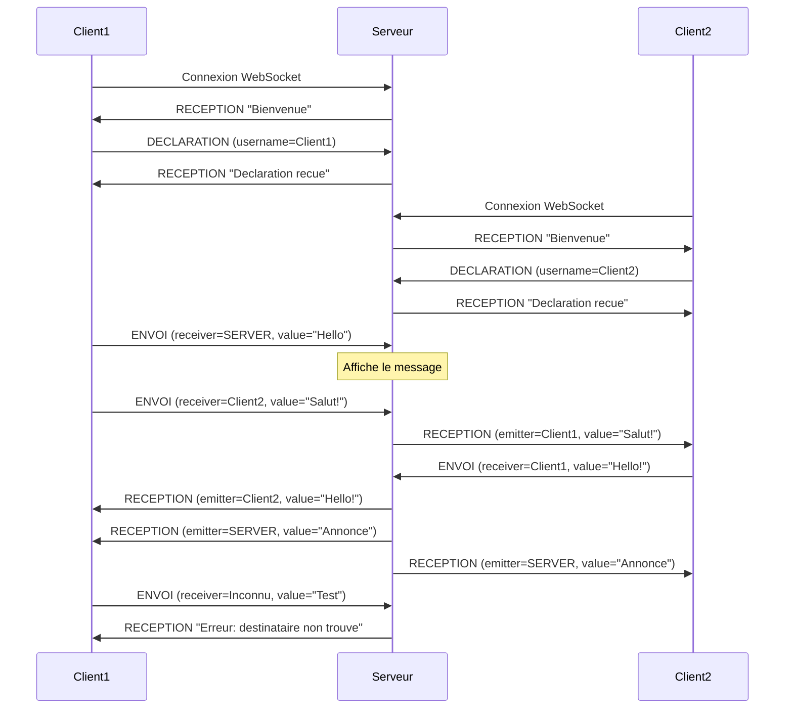
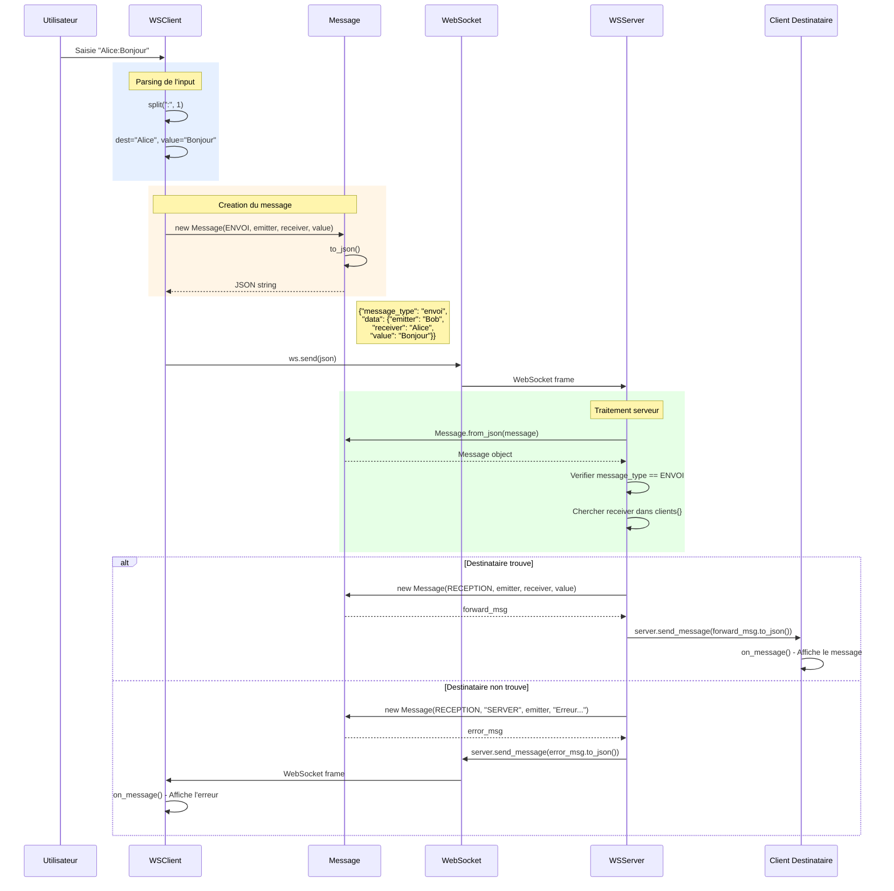
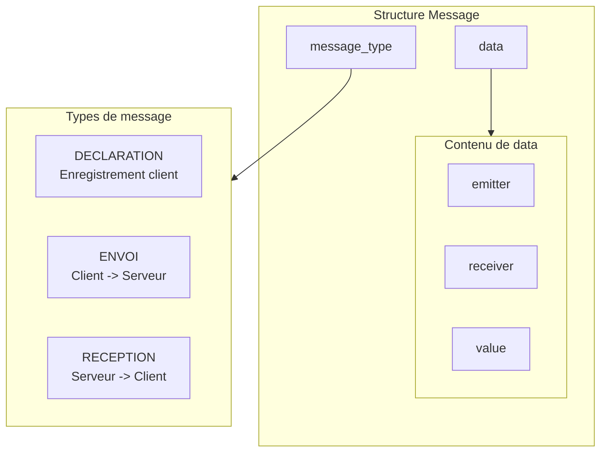

# Diagramme de Sequence - Messagerie WebSocket

Ce diagramme illustre les flux de communication du projet de messagerie WebSocket.

## Flux de communication



## Description des flux

### 1. Connexion d'un client
- Client -> Serveur : Connexion WebSocket
- Serveur -> Client : Message "Bienvenue" (RECEPTION)
- Client -> Serveur : Message DECLARATION (s'enregistrer avec username)
- Serveur -> Client : Confirmation de declaration (RECEPTION)

### 2. Envoi de message client -> serveur
- Client -> Serveur : Message ENVOI (receiver="SERVER")
- Le serveur affiche le message

### 3. Envoi de message client -> client
- ClientA -> Serveur : Message ENVOI (receiver="ClientB")
- Serveur -> ClientB : Message RECEPTION (forward)
- Si destinataire inconnu : Serveur -> ClientA : Message erreur

### 4. Broadcast serveur -> tous
- Serveur -> Tous les clients : Message RECEPTION

---

## Diagramme detaille - Envoi de message

Ce diagramme montre le flux interne lors de l'envoi d'un message d'un client vers un autre.



## Diagramme - Structure du Message JSON



## Diagramme - Traitement selon le type de message

```mermaid
flowchart TD
    A[Message recu par serveur] --> B{message_type?}

    B -->|DECLARATION| C[Enregistrer client]
    C --> C1[clients dict emitter = client]
    C1 --> C2[Envoyer confirmation RECEPTION]

    B -->|ENVOI| D{receiver == SERVER?}
    D -->|Oui| E[Afficher message sur console serveur]
    D -->|Non| F{receiver existe?}

    F -->|Oui| G[Creer message RECEPTION]
    G --> H[Forward au destinataire]

    F -->|Non| I[Creer message erreur]
    I --> J[Envoyer erreur a emitter]
